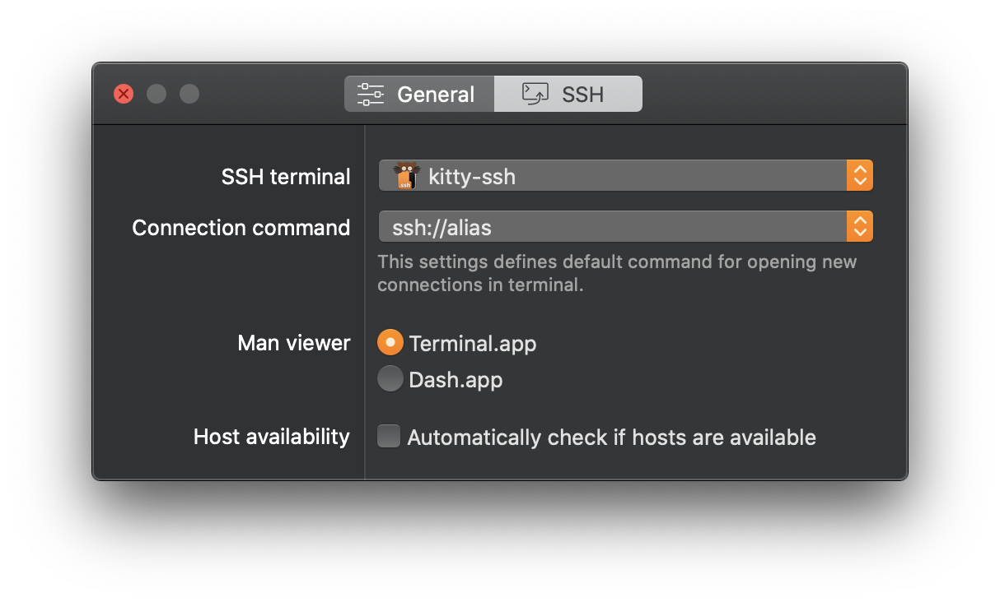

<p align="center">
    
</p>

This macOS app handles ssh URLs and opens it in [kitty terminal](https://sw.kovidgoyal.net/kitty/index.html#) application.

## Install

1. Download [last version](https://github.com/Hejki/kitty-ssh/releases/tag/1.0)
2. Unzip it
3. Copy `kitty-ssh.app` to `/Application` folder

## SSH Config Editor

This utility application was originally created to be able to use a *kitty* terminal to open connections from a *[SSH Config Editor](https://hejki.org/ssheditor/)* application. To use *kitty* for connections set `kitty-ssh` as terminal and `ssh://alias` as connection command in *SSH Config Editor* preferences.



### Examle use from command line
```shell
> open -b org.hejki.macos.kitty-ssh ssh://your-host
```
